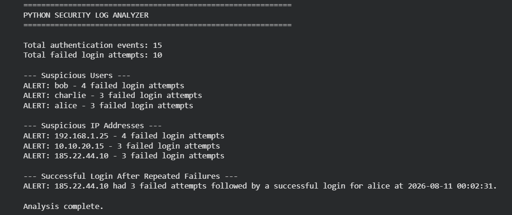

# Python Security Log Analyzer

## Project Overview

This project demonstrates how Python can be used to automate the analysis of authentication logs. The script reads a CSV file containing login events and identifies repeated failed login attempts, suspicious users, suspicious IP addresses, and successful logins following repeated failures.

The goal of the project is to demonstrate how basic Python programming concepts can support repetitive security analysis tasks.

---

## Objective

The objective of this project was to build a lightweight security log analyzer that can automatically identify authentication patterns that may require further investigation.

The analyzer processes authentication records and generates alerts when predefined conditions are met.

---

## Scenario

A company wants to monitor authentication activity for signs of suspicious login behavior. Manually reviewing large numbers of authentication events can be time-consuming.

A Python-based analyzer can automate the initial review by identifying repeated failed login attempts and highlighting potentially suspicious patterns for a security analyst to investigate.

---

## Tools & Technologies

- Python
- CSV
- Google Colab
- GitHub

---

## Dataset

The project uses a synthetic authentication log dataset called `login_events.csv`.

The dataset contains:

| Field | Description |
|---|---|
| `event_id` | Unique identifier for the login event |
| `timestamp` | Date and time of the event |
| `username` | Account associated with the login |
| `ip_address` | IP address associated with the event |
| `status` | Login status: success or failed |
| `location` | Location associated with the event |

---

# 🔎 Detection Logic

The Python analyzer performs several security checks.

### 1. Count Failed Login Attempts

The script identifies all authentication events where the status is `failed`.

### 2. Identify Suspicious Users

Users with **three or more failed login attempts** are flagged for further investigation.

### 3. Identify Suspicious IP Addresses

IP addresses associated with **three or more failed login attempts** are flagged.

### 4. Detect Potential Suspicious Login Patterns

The analyzer checks whether an IP address with repeated failed attempts was also associated with a successful login.

This pattern is treated as suspicious activity requiring further investigation rather than automatically being classified as a confirmed attack.

---

# 📊 Investigation Results

The analyzer identified:

- **15 total authentication events**
- **10 failed login attempts**
- `bob` — 4 failed attempts
- `alice` — 3 failed attempts
- `charlie` — 3 failed attempts

The following IP addresses generated repeated failed login attempts:

| IP Address | Failed Attempts |
|---|---:|
| `192.168.1.25` | 4 |
| `10.10.20.15` | 3 |
| `185.22.44.10` | 3 |

The most notable pattern involved:

`185.22.44.10`

This IP address generated three failed login attempts against `alice`, followed by a successful login.

---

# 🖥️ Evidence

The following screenshot shows the output generated by the Python security log analyzer.



---

# 🛡️ Security Recommendations

Based on the analysis, the following actions could be considered:

### 1. Investigate affected accounts

Review accounts with repeated failed authentication attempts to determine whether the activity was legitimate.

### 2. Investigate suspicious IP addresses

Review additional security logs and available threat intelligence to determine whether flagged IP addresses are associated with suspicious activity.

### 3. Enable multi-factor authentication

MFA can provide additional protection if user credentials are compromised.

### 4. Monitor repeated authentication failures

Organizations can create alerts for repeated failed login attempts and other unusual authentication patterns.

### 5. Correlate with additional security logs

Authentication events should be correlated with other sources such as firewall, VPN, endpoint, and SIEM logs before confirming a security incident.

---

# 💻 Python Concepts Demonstrated

This project demonstrates practical use of:

- Variables
- Lists
- Dictionaries
- `for` loops
- `if` statements
- Functions
- File handling
- CSV parsing
- Conditional logic
- Basic automation

---

# 🔐 Security Skills Demonstrated

- Authentication log analysis
- Security event detection
- Pattern identification
- Suspicious login investigation
- Basic security automation
- Security findings documentation
- Security recommendations

---
# 📌 Conclusion

This project demonstrates how basic Python programming can be used to automate repetitive security log analysis tasks. The analyzer identifies failed authentication patterns and highlights users and IP addresses that require further investigation. The results demonstrate how scripting can support security analysts by reducing manual log review and providing an initial layer of automated detection.

# 📁 Project Structure

```text
python-security-log-analyzer/
│
├── README.md
├── security_log_analyzer.py
├── login_events.csv
│
└── screenshots/
    └── 01-security-log-analysis.png
